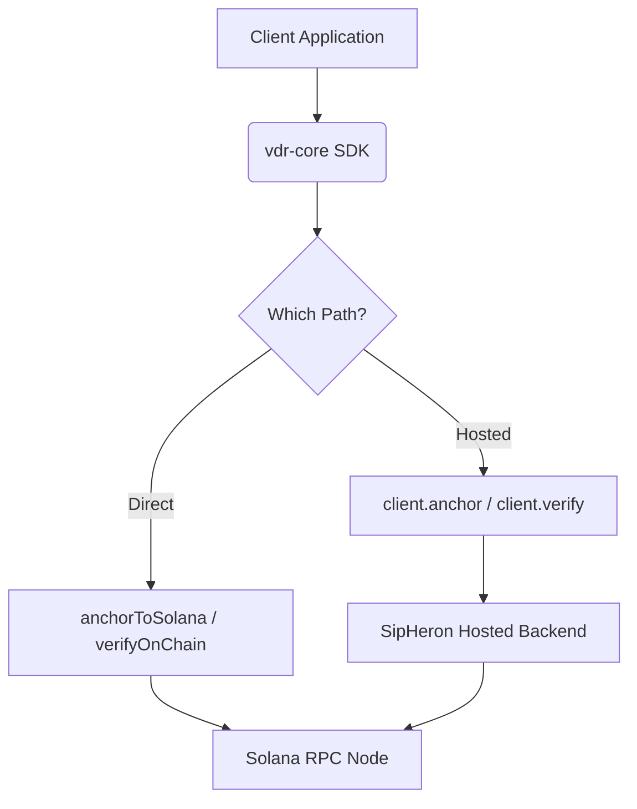

# Architecture Details

Welcome to the internal workings of **SipHeron VDR Core**. This document outlines how the SDK guarantees cryptographic authenticity, handles dual-method integrations (Direct vs. Hosted), and enforces strict localization for zero-knowledge proofs.

## 1. Zero-Knowledge Proof Through Local Hashing

A non-negotiable principle of SipHeron VDR is that **raw files must never be transmitted to the application layer unhashed**. 

### The Flow
1. User provides a `Buffer` or a `ReadStream` representing the document.
2. The `vdr-core` SDK consumes the payload through native Crypto APIs (e.g. `crypto.createHash('sha256')` in Node or `SubtleCrypto` in the Browser).
3. The SDK transforms massive files via standard 64kb pipeline blocks (`hashFileStream()`), avoiding RAM overflow.
4. Exactly **64 characters** of a Hex string (the SHA-256 digest) are outputted. 

Only this string is ever shipped over HTTP or over standard Solana RPC vectors. Because SHA-256 is deterministic and irreversible, it acts as an absolute one-way commitment schema.

## 2. Dual Architecture Paths

Our `vdr-core` supports two modes entirely unified underneath the exact same SDK logic. 

### Direct On-Chain
When you invoke **`anchorToSolana()`** or **`verifyOnChain()`**:
- The SDK utilizes `@solana/web3.js` to build a transaction signed by a locally-provided `Keypair`.
- Using deterministic **Program Derived Addresses (PDAs)**, the seed is defined as `[ "anchor", Buffer.from(hash) ]`. This mathematically ensures only one unique anchor can exist on the blockchain per document signature within the SipHeron App bounds.
- No `apiKey` is required. The ledger acts completely permissionlessly.

### Hosted SaaS Environment
When utilizing the `new SipHeron(config)` proxy wrapper:
- It wraps the Axios interface to communicate with `api.sipheron.com`.
- Handles retry logic, error serialization, and JSON decoding of expanded Metadata.
- Enables you to run compliance protocols, fetch Certificates, and listen to Webhooks.

## 3. The Soft Revocation Registry

Sometimes, an authentic document becomes outdated. It has not been *tampered with*, but it has been *superseded*. Because blockchains are fundamentally immutable, deleting an Anchor goes against the entire ledger thesis. 

Instead, SipHeron applies an architecture known as **Soft Revocation**.
- If a document is superseded (e.g., an amendment replaces a contract), it is flagged in the registry.
- `vdr-core` exposes `client.anchors.revoke()` which flags this on the registry layer.
- During `client.verify({ file })`, if the anchor has the revoked flag, the response gracefully resolves `authentic: true` but `status: 'revoked'`.
- It returns a heavily typed `RevocationRecord` exposing `reason`, `revokedAt`, and critically, `supersededByAnchorId` to trace the compliance chain directly to the newest version.

## 4. Webhook Integrity (HMAC-SHA256)

Hosted apps receive Webhooks. `vdr-core` exports the exact utility to parse them: `parseWebhookEvent`. 

We mandate cryptographic identity verification here via **HMAC-SHA256**. The backend signs the raw bodily string against the customer's Dashboard Secret. The SDK ensures the computed `digest` locally matches the `x-sipheron-signature` header via **constant-time string comparison**, averting timing attacks.
